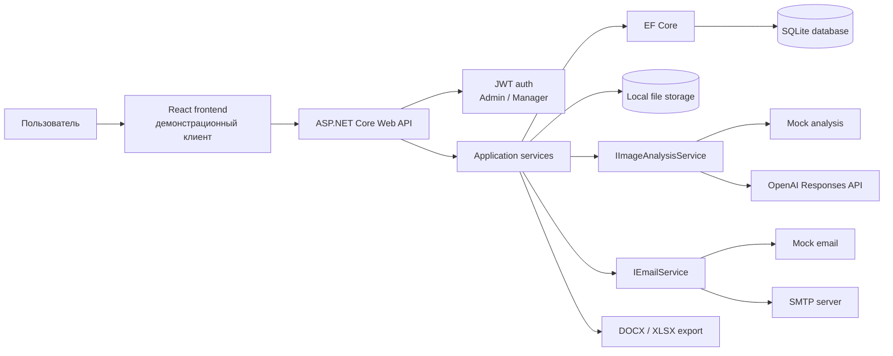

# Car Damage Claims AI


Сервис для обработки заявок на оценку повреждений автомобиля по фотографиям. Пользователь отправляет данные автомобиля и снимки повреждений, backend валидирует заявку, сохраняет файлы, выполняет AI-анализ и передает результат в административный сценарий.

Проект сделан как законченный portfolio-проект backend-разработчика: с авторизацией, работой с БД, интеграциями, локальным mock-режимом, экспортом документов и демонстрационным клиентом.

> Фронтенд используется как демонстрационный клиент для backend API. Основной фокус проекта - backend-архитектура, бизнес-логика и интеграции.

## Что демонстрирует проект

- Проектирование ASP.NET Core Web API с тонкими контроллерами и сервисным слоем.
- JWT-аутентификацию, роли `Admin` и `Manager`, защищенные административные endpoints.
- Работу с EF Core, миграциями, связями, индексами и SQLite для локального запуска.
- Прием multipart/form-data, валидацию изображений, сохранение файлов и очистку при ошибках.
- Интеграцию с OpenAI Responses API через отдельную инфраструктурную реализацию.
- Изоляцию внешних сервисов через интерфейсы `IImageAnalysisService` и `IEmailService`.
- Mock-режим для запуска без OpenAI API key и SMTP credentials.
- SMTP-уведомления, историю отправок, повторную отправку неуспешных писем.
- Экспорт одной заявки в DOCX и списка заявок в XLSX.
- Аккуратную обработку ошибок: валидация, `401`, `413`, `429`, `503`, конфликтные статусы заявки.

## Основные возможности

- Публичная подача заявки на оценку повреждений автомобиля.
- Загрузка от 1 до 3 фотографий в форматах JPEG, PNG или WebP.
- Автоматический анализ изображений и предварительная оценка стоимости ремонта.
- Административная панель со списком заявок, поиском, сортировкой, пагинацией и карточкой заявки.
- Одобрение, отклонение и повторный AI-анализ заявки.
- Управление пользователями административной части.
- Email-уведомления по результатам обработки заявки.
- Просмотр истории email-уведомлений и повторная отправка неуспешных писем.
- Экспорт детального отчета по заявке в DOCX.
- Экспорт списка заявок в XLSX.
- Swagger/OpenAPI в development-режиме.
- Защищенный health endpoint для проверки состояния API.

## Технологический стек

| Область | Технологии |
| --- | --- |
| Backend | .NET 8, ASP.NET Core Web API, C# |
| Auth | JWT Bearer, role-based authorization, BCrypt |
| Data access | EF Core 8, SQLite, migrations |
| AI-интеграция | OpenAI Responses API, HttpClient, JSON parsing |
| Email | MailKit, SMTP, HTML/Text templates |
| Документы | OpenXML SDK для DOCX, ClosedXML для XLSX |
| File storage | Локальное файловое хранилище `storage/` |
| Frontend | React, TypeScript, Vite, ESLint |
| Документация API | Swagger/OpenAPI |

## Архитектура

Backend построен вокруг контроллеров, application services и инфраструктурных адаптеров. Контроллеры принимают HTTP-запросы и возвращают корректные HTTP-ответы, а бизнес-сценарии вынесены в сервисы.

Основные зоны ответственности:

- `Controllers` - публичные и административные endpoints.
- `Services/Requests` - создание заявки, валидация файлов, сохранение фотографий.
- `Services/AdminRequests` - поиск, обновление, статусы, решения по заявкам, повторный анализ и экспорт.
- `Services/ImageAnalysis` - контракт анализа изображений, mock-реализация и OpenAI-адаптер.
- `Services/Email` - контракт отправки email, SMTP-реализация, mock-реализация и шаблоны писем.
- `Data` и `Models` - EF Core `DbContext`, доменные сущности и связи.
- `Localization` - сообщения ошибок и подписи для русского/английского интерфейса.

Внешние зависимости подключаются через интерфейсы. Это позволяет запускать проект локально без внешних credentials и не смешивать бизнес-сценарии с деталями OpenAI, SMTP или файлового хранилища.



## Ключевой сценарий работы

1. Пользователь открывает демонстрационный frontend и создает заявку на оценку повреждений.
2. Пользователь указывает контактные данные, автомобиль и прикрепляет фотографии повреждений.
3. Backend принимает `multipart/form-data`, валидирует поля формы, типы файлов, количество и размер изображений.
4. Фотографии сохраняются в локальное хранилище, заявка создается в БД через EF Core.
5. Система выполняет AI-анализ изображений через `IImageAnalysisService`.
6. При наличии OpenAI API key используется OpenAI Responses API; без ключа включается `MockImageAnalysisService`.
7. Результат анализа сохраняется в заявке: сводка, найденные повреждения, уверенность и ориентировочная стоимость.
8. Администратор или менеджер просматривает заявку в административной части.
9. Заявка одобряется, отклоняется или отправляется на повторный анализ.
10. При одобрении формируется email-уведомление, сохраняется запись в истории отправок.
11. Администратор может выгрузить отчет по заявке в DOCX или список заявок в XLSX.

## Backend-особенности

- ASP.NET Core Web API с явным разделением HTTP-слоя и бизнес-сценариев.
- JWT Bearer authentication и role-based authorization для административных endpoints.
- Ограничение частоты попыток входа: не более 5 попыток в минуту с одного IP.
- EF Core migrations, связи `one-to-many`, индексы по статусу, дате создания, email и статусам уведомлений.
- Транзакционный сценарий создания заявки: БД и файлы согласованы, записанные изображения очищаются при ошибках анализа.
- Валидация изображений: максимум 3 файла, до 10 МБ на файл, только JPEG/PNG/WebP.
- Глобальный лимит multipart-запроса 24 МБ и корректный ответ `413 Payload Too Large`.
- OpenAI-интеграция отделена от application services и может быть заменена mock-реализацией.
- SMTP-отправка отделена через `IEmailService`; при неполной конфигурации используется `MockEmailService`.
- История email-уведомлений хранится в БД, для failed-сообщений доступна повторная отправка.
- Статусы заявки ограничены допустимыми переходами, некорректные переходы возвращают понятные ошибки.
- Экспорт DOCX проходит проверку целостности результата перед отдачей файла.
- Swagger доступен в development-режиме, health endpoint защищен административной авторизацией.

## Интеграции

| Интеграция | Как используется | Локальный режим |
| --- | --- | --- |
| OpenAI Responses API | Анализ фотографий, определение повреждений, предварительная оценка стоимости | Если `OpenAi:ApiKey` пустой, используется `MockImageAnalysisService` |
| SMTP | Отправка уведомлений пользователю после решения по заявке | Если SMTP настроен неполностью, используется `MockEmailService` |
| File storage | Сохранение загруженных фотографий в `storage/` и раздача через `/storage` | Работает локально без внешних сервисов |
| DOCX export | Детальный отчет по одной заявке | Генерируется backend-сервисом через OpenXML |
| XLSX export | Список заявок для административной выгрузки | Генерируется backend-сервисом через ClosedXML |

## Локальный запуск

Требования:

- .NET SDK 8.x
- Node.js 18+
- npm

Backend:

```bash
cd backend
dotnet restore
dotnet run --project src/CarDamageClaims.Api --launch-profile http
```

Backend будет доступен на `http://localhost:5198`. Swagger в development-режиме доступен на `http://localhost:5198/swagger`.

Frontend:

```bash
cd frontend
npm install
cp .env.example .env.local
npm run dev -- --host localhost --port 5173 --strictPort
```

Frontend будет доступен на `http://localhost:5173`.

При первом запуске backend применяет миграции EF Core, создает локальную SQLite-базу, каталог `storage/` и dev-пользователя для административной части. Dev-seeding предназначен только для локального сценария; для любого нелокального окружения учетные данные и секреты нужно заменить.

Docker-конфигурации в репозитории сейчас нет: проект рассчитан на прямой локальный запуск backend и frontend.

## Конфигурация

В репозитории хранятся только безопасные значения для локального запуска. Секреты не должны попадать в Git: используйте переменные окружения, user secrets или локальные config-файлы вне репозитория.

Основные backend-файлы конфигурации:

- `backend/src/CarDamageClaims.Api/appsettings.json`
- `backend/src/CarDamageClaims.Api/appsettings.Development.json`

Основные параметры:

| Параметр | Назначение |
| --- | --- |
| `ConnectionStrings__DefaultConnection` | Путь к SQLite-базе |
| `Jwt__Issuer` | Issuer для JWT |
| `Jwt__Audience` | Audience для JWT |
| `Jwt__Key` | Симметричный ключ подписи JWT |
| `Jwt__ExpiresMinutes` | Время жизни access token |
| `OpenAi__ApiKey` или `OPENAI_API_KEY` | Ключ OpenAI; пустое значение включает mock-анализ |
| `OpenAi__Model` или `OPENAI_MODEL` | Модель OpenAI |
| `OpenAi__BaseUrl` | Base URL OpenAI API |
| `OpenAi__ProxyUrl` | Опциональный proxy для OpenAI HTTP-клиента |
| `Email__Host` | SMTP host |
| `Email__Port` | SMTP port |
| `Email__Username` | SMTP username |
| `Email__Password` | SMTP password |
| `Email__FromName` | Имя отправителя |
| `Email__FromEmail` | Email отправителя |

Frontend использует `frontend/.env.local`:

```env
VITE_API_BASE_URL=http://localhost:5198
```

OpenAI-запросы можно направить через proxy, указав `OpenAi__ProxyUrl`, например `socks5://127.0.0.1:1080`. Proxy применяется только к HTTP-клиенту OpenAI.

## API

Swagger доступен в development-режиме по адресу `http://localhost:5198/swagger`.

Публичные endpoints:

- `POST /api/requests` - создание заявки, `multipart/form-data`.

Аутентификация:

- `POST /api/auth/login` - получение JWT access token.

Административные заявки:

- `GET /api/admin/requests` - список заявок с поиском, сортировкой и пагинацией.
- `GET /api/admin/requests/{id}` - детали заявки.
- `PUT /api/admin/requests/{id}` - обновление заявки.
- `POST /api/admin/requests/{id}/approve` - одобрение заявки.
- `POST /api/admin/requests/{id}/reject` - отклонение заявки.
- `POST /api/admin/requests/{id}/reanalyze` - повторный AI-анализ.
- `GET /api/admin/requests/{id}/export` - экспорт заявки в DOCX.
- `GET /api/admin/requests/export` - экспорт списка заявок в XLSX.
- `GET /api/admin/requests/notifications/history` - история email-уведомлений.

Административные пользователи:

- `GET /api/admin/users` - список пользователей.
- `POST /api/admin/users` - создание пользователя.
- `PUT /api/admin/users/{id}` - обновление пользователя.

Email:

- `POST /api/admin/emails/{id}/resend` - повторная отправка failed-уведомления.

Health:

- `GET /api/health` - защищенная проверка состояния API.

## Проверка качества

Команды для локальной проверки из корня репозитория:

```bash
dotnet build backend/CarDamageClaims.sln
npm --prefix frontend run lint
npm --prefix frontend run typecheck
npm --prefix frontend run build
```

Ручной smoke-test:

- Подать публичную заявку с фотографиями.
- Войти в административную часть.
- Открыть детали заявки и проверить результат анализа.
- Одобрить или отклонить заявку.
- Проверить историю email-уведомлений.
- Экспортировать заявку в DOCX и список заявок в XLSX.

## Ограничения

- Это portfolio-проект, а не production enterprise-система.
- SQLite и локальное файловое хранилище выбраны для простого локального запуска.
- AI-анализ дает предварительную оценку и не заменяет профессиональную экспертизу автомобиля.
- SMTP-уведомления отправляются синхронно в рамках административного действия; отдельного background worker сейчас нет.
- Docker Compose в репозитории пока отсутствует.
- Автоматические backend-тесты пока не добавлены; качество проверяется сборкой, frontend lint/typecheck/build и ручным smoke-test.
- Frontend демонстрирует работу API, но не является основной частью проекта.

## Возможные улучшения

- Добавить unit- и integration-тесты для backend-сервисов и API endpoints.
- Добавить Docker Compose для единого запуска backend и frontend.
- Вынести dev-seeding администратора в конфигурацию или user secrets.
- Добавить background worker для email-очереди и повторных попыток отправки.
- Подключить объектное хранилище для файлов, если потребуется сценарий ближе к production.
- Расширить аудит действий администратора.

## Для работодателя / технического интервьюера

Этот проект может быть полезен для оценки backend-навыков, потому что в нем есть не только CRUD, но и законченный прикладной сценарий: прием файлов, хранение данных, внешние интеграции, административный workflow, документы и уведомления.

Что особенно стоит посмотреть:

- Как устроены контроллеры и сервисы в `backend/src/CarDamageClaims.Api`.
- Как изолированы OpenAI и SMTP через интерфейсы и mock-реализации.
- Как реализованы валидация файлов, транзакция создания заявки и очистка файлов при ошибках.
- Как описаны статусы заявки и допустимые переходы.
- Как формируются DOCX/XLSX-экспорты.
- Как проект запускается локально без внешних credentials.

Проект не пытается выглядеть больше, чем он есть. Его задача - показать аккуратную backend-разработку, работу с интеграциями, поддерживаемую структуру и способность доводить pet-проект до завершенного состояния.
