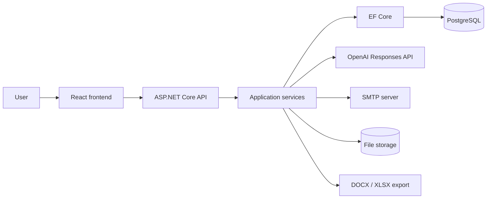
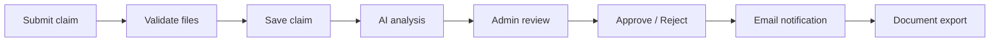

# Car Damage Claims AI

[](https://github.com/steel-snake-sx/car-damages-ai/actions/workflows/ci.yml)
[](LICENSE)


MVP-сервис для обработки заявок на оценку повреждений автомобиля по фотографиям.

Пользователь отправляет данные автомобиля, контактную информацию и фотографии повреждений. Система валидирует заявку, сохраняет файлы, выполняет предварительный AI-анализ, передает результат администратору и помогает завершить обработку уведомлением и экспортом документов.

## Основные возможности

- Публичная подача заявки на оценку повреждений автомобиля.
- Загрузка от 1 до 3 фотографий в форматах JPEG, PNG или WebP; frontend также принимает HEIC/HEIF и конвертирует их в JPEG перед отправкой.
- Автоматический анализ изображений и предварительная оценка стоимости ремонта.
- Административная панель со списком заявок, поиском, сортировкой и карточкой заявки.
- Одобрение, отклонение и повторный AI-анализ заявки.
- Управление пользователями административной части с ролями `Admin` и `Manager`.
- Email-уведомления по результатам обработки заявки.
- История email-уведомлений и повторная отправка неуспешных писем.
- Экспорт детального отчета по заявке в DOCX.
- Экспорт списка заявок в XLSX.
- Swagger/OpenAPI в development-режиме.
- Защищенный health endpoint для проверки состояния API.

## Ключевой сценарий работы

1. Пользователь открывает frontend и создает заявку на оценку повреждений.
2. Пользователь указывает контактные данные, автомобиль и прикрепляет фотографии.
3. Backend принимает `multipart/form-data`, валидирует поля формы, типы файлов, количество и размер изображений. API принимает JPEG, PNG и WebP; HEIC/HEIF поддерживается на frontend через конвертацию в JPEG.
4. Фотографии сохраняются в локальное хранилище, заявка создается в PostgreSQL через EF Core.
5. Система выполняет AI-анализ изображений через `IImageAnalysisService`.
6. При наличии OpenAI API key используется OpenAI Responses API; без ключа включается mock-анализ.
7. Администратор или менеджер просматривает заявку в административной части.
8. Заявка одобряется, отклоняется или отправляется на повторный анализ.
9. При решении по заявке формируется email-уведомление и запись в истории отправок.
10. Администратор выгружает отчет по заявке в DOCX или список заявок в XLSX.

## Архитектура

Backend построен вокруг контроллеров, application services и инфраструктурных адаптеров. Контроллеры принимают HTTP-запросы и возвращают корректные HTTP-ответы, а бизнес-сценарии вынесены в сервисы.

Основные зоны ответственности:

- `Controllers` - публичные и административные endpoints.
- `Services/Requests` - создание заявки, валидация файлов, сохранение фотографий.
- `Services/AdminRequests` - поиск, обновление, статусы, решения по заявкам, повторный анализ и экспорт.
- `Services/ImageAnalysis` - контракт анализа изображений, mock-реализация и OpenAI-адаптер.
- `Services/Email` - контракт отправки email, SMTP-реализация, mock-реализация и шаблоны писем.
- `Data` и `Models` - EF Core `DbContext`, доменные сущности и связи.
- `Localization` - сообщения ошибок и подписи для русского/английского интерфейса.

Внешние зависимости подключаются через интерфейсы. Это позволяет запускать сервис локально без OpenAI и SMTP credentials и не смешивать бизнес-сценарии с деталями внешних интеграций.

## Mermaid-схемы

Компонентная архитектура:



Основной сценарий обработки заявки:



## Технологический стек

| Область | Технологии |
| --- | --- |
| Backend | .NET 8, ASP.NET Core Web API, C# |
| Auth | JWT Bearer, role-based authorization, BCrypt |
| Data access | EF Core 8, PostgreSQL, migrations, Npgsql |
| AI-интеграция | OpenAI Responses API, HttpClient, JSON parsing |
| Email | MailKit, SMTP, HTML/Text templates |
| Документы | OpenXML SDK для DOCX, ClosedXML для XLSX |
| File storage | Локальное файловое хранилище `storage/` |
| Frontend | React, TypeScript, Vite, ESLint |
| Инфраструктура | Docker Compose для PostgreSQL |
| Документация API | Swagger/OpenAPI |

## Backend-особенности / Технические акценты

- ASP.NET Core Web API с явным разделением HTTP-слоя и бизнес-сценариев.
- JWT Bearer authentication и role-based authorization для административных endpoints.
- Ограничение частоты попыток входа: не более 5 попыток в минуту с одного IP.
- EF Core migrations, связи `one-to-many`, индексы по статусу, дате создания, email и статусам уведомлений.
- Транзакционный сценарий создания заявки: БД и файлы согласованы, записанные изображения очищаются при ошибках анализа.
- Валидация изображений: максимум 3 файла, до 10 МБ на файл, только JPEG/PNG/WebP.
- Глобальный лимит multipart-запроса 24 МБ и корректный ответ `413 Payload Too Large`.
- OpenAI-интеграция отделена от application services и может быть заменена mock-реализацией.
- SMTP-отправка отделена через `IEmailService`; при неполной конфигурации используется `MockEmailService`.
- История email-уведомлений хранится в БД, для failed-сообщений доступна повторная отправка.
- Статусы заявки ограничены допустимыми переходами, некорректные переходы возвращают понятные ошибки.
- Экспорт DOCX проходит проверку целостности результата перед отдачей файла.

## Интеграции

| Интеграция | Как используется | Локальный режим |
| --- | --- | --- |
| OpenAI Responses API | Анализ фотографий, определение повреждений, предварительная оценка стоимости | Если ключ не задан, используется `MockImageAnalysisService` |
| SMTP | Отправка уведомлений пользователю после решения по заявке | Если SMTP настроен неполностью, используется `MockEmailService` |
| File storage | Сохранение загруженных фотографий в `storage/` и раздача через `/storage` | Работает локально без внешних сервисов |
| DOCX export | Детальный отчет по одной заявке | Генерируется backend-сервисом через OpenXML |
| XLSX export | Список заявок для административной выгрузки | Генерируется backend-сервисом через ClosedXML |

## Локальный запуск

Требования:

- .NET SDK 8.x
- Node.js 18+
- npm
- Docker с Docker Compose

## Запуск через Docker

Весь стек можно поднять одной командой из корня репозитория:

```bash
docker compose up --build
```

Будут запущены PostgreSQL, ASP.NET Core API и frontend на nginx.

Адреса:

- Frontend: `http://localhost:5173`
- Backend API: `http://localhost:5000`
- Swagger: `http://localhost:5000/swagger`
- Health endpoint: `http://localhost:5000/api/health` (требует JWT)

Docker-запуск по умолчанию работает в mock-режиме без OpenAI и SMTP credentials. PostgreSQL использует локальные dev-значения из `docker-compose.yml`, backend сам применяет EF migrations при старте и сохраняет загруженные файлы в Docker volume `backend-storage`.

Реальные OpenAI/SMTP credentials не добавляйте в `docker-compose.yml`. Если нужно проверить реальные интеграции в Docker, используйте локальные environment variables или untracked `docker-compose.override.yml`.

Остановить стек:

```bash
docker compose down
```

PostgreSQL:

```bash
docker compose up -d postgres
```

Backend:

```bash
cd backend
cp .env.example .env
dotnet restore
dotnet run --project src/CarDamageClaims.Api --launch-profile http
```

Backend будет доступен на `http://localhost:5198`. Swagger в development-режиме доступен на `http://localhost:5198/swagger`.

Frontend:

```bash
cd frontend
npm install
cp .env.example .env.local
npm run dev -- --host localhost --port 5173 --strictPort
```

Frontend будет доступен на `http://localhost:5173`.

При первом запуске backend применяет миграции EF Core, создает таблицы в PostgreSQL, каталог `storage/` и dev-пользователя для административной части.

Локальный dev-доступ в административную часть:

- Email: `admin@example.com`
- Password: `123`

## Конфигурация

`appsettings.json` содержит безопасные дефолты для локального запуска. Чувствительные значения и переопределения передаются через environment variables или .NET user-secrets. Не храните реальные OpenAI/SMTP/JWT credentials в tracked-файлах.

Пример backend-переменных находится в `backend/.env.example`:

```bash
cd backend
cp .env.example .env
```

Заполните значения при необходимости. Без OpenAI credentials используется mock-анализ изображений; без полной SMTP-конфигурации используется mock-отправка email.

Для проверки реальных интеграций безопаснее использовать .NET user-secrets из корня репозитория:

```bash
dotnet user-secrets set --project backend/src/CarDamageClaims.Api "OpenAi:ApiKey" "<openai-api-key>"
dotnet user-secrets set --project backend/src/CarDamageClaims.Api "OpenAi:Model" "gpt-4.1"
dotnet user-secrets set --project backend/src/CarDamageClaims.Api "OpenAi:ProxyUrl" "<optional-socks5-proxy-url>"

dotnet user-secrets set --project backend/src/CarDamageClaims.Api "Email:Host" "<smtp-host>"
dotnet user-secrets set --project backend/src/CarDamageClaims.Api "Email:Port" "<smtp-port>"
dotnet user-secrets set --project backend/src/CarDamageClaims.Api "Email:Username" "<smtp-username>"
dotnet user-secrets set --project backend/src/CarDamageClaims.Api "Email:Password" "<smtp-password>"
dotnet user-secrets set --project backend/src/CarDamageClaims.Api "Email:FromEmail" "<from-email>"
```

После локальной real-integration проверки секреты можно удалить:

```bash
dotnet user-secrets clear --project backend/src/CarDamageClaims.Api
```

Frontend использует `frontend/.env.local`:

```env
VITE_API_BASE_URL=http://localhost:5198
```

## API

Swagger доступен в development-режиме по адресу `http://localhost:5198/swagger`.

Публичные endpoints:

- `POST /api/requests` - создание заявки, `multipart/form-data`.

Аутентификация:

- `POST /api/auth/login` - получение JWT access token.

Административные заявки:

- `GET /api/admin/requests` - список заявок с поиском, сортировкой и пагинацией.
- `GET /api/admin/requests/{id}` - детали заявки.
- `PUT /api/admin/requests/{id}` - обновление заявки.
- `POST /api/admin/requests/{id}/approve` - одобрение заявки.
- `POST /api/admin/requests/{id}/reject` - отклонение заявки.
- `POST /api/admin/requests/{id}/reanalyze` - повторный AI-анализ.
- `GET /api/admin/requests/{id}/export` - экспорт заявки в DOCX.
- `GET /api/admin/requests/export` - экспорт списка заявок в XLSX.
- `GET /api/admin/requests/notifications/history` - история email-уведомлений.

Административные пользователи:

- `GET /api/admin/users` - список пользователей.
- `POST /api/admin/users` - создание пользователя.
- `PUT /api/admin/users/{id}` - обновление пользователя.

Email:

- `POST /api/admin/emails/{id}/resend` - повторная отправка failed-уведомления.

Health:

- `GET /api/health` - защищенная проверка состояния API.

## Проверка качества

Команды для локальной проверки из корня репозитория:

```bash
dotnet build backend/CarDamageClaims.sln
npm --prefix frontend run lint
npm --prefix frontend run typecheck
npm --prefix frontend run build
docker compose config
```

Ручной smoke-test:

- Подать публичную заявку с фотографиями.
- Войти в административную часть.
- Открыть детали заявки и проверить результат анализа.
- Одобрить или отклонить заявку.
- Проверить историю email-уведомлений.
- Экспортировать заявку в DOCX и список заявок в XLSX.

## Статус проекта

- Реализован основной end-to-end workflow: подача заявки, AI-анализ, административная обработка, уведомления и экспорт документов.
- Локальная инфраструктура использует PostgreSQL в Docker Compose и локальное файловое хранилище.
- OpenAI и SMTP являются опциональными для локального запуска благодаря mock-реализациям.
- AI-анализ дает предварительную оценку и не заменяет профессиональную экспертизу автомобиля.
- Backend-проверка сейчас покрыта сборкой и ручным smoke-test; отдельные автоматические backend-тесты можно добавить следующим этапом.
